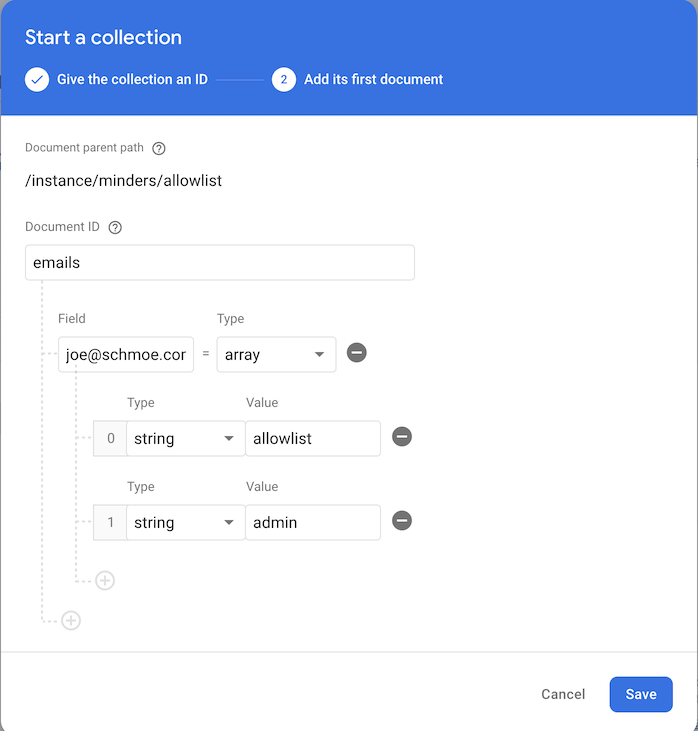

# Configuring Firebase

The default set up for new NPE Toolkit apps is to use Firebase for data storage
and auth.

These are not required dependencies for using the NPE Toolkit, but our new
project template depends on them and if you are using this template you'll need
to set up a Firebase project.

This doc will take you through the steps.

### 1. Create a Firebase project

- Go to the [Firebase Console](https://console.firebase.google.com/).
- Click on the "Add Project" button
- Go through the new project setup flow
  - Google Analytics is recommended but not required

### 2. Enable Firebase services

All of the following services are listed under "Build" on the left side

#### Enable Firebase Auth

We recommend starting with Google Auth as a provider as it is easy to create
allowlists based on emails

- Click on Authentication > Get Started
- Enable Google Auth
  - You'll need to add a "project support email"

#### Enable Firestore

Firestore is the a modern noSQL database with an API that can be called directly
from client code and server-side privacy rule enforcement.

- Click on Firestore > Create database
- Start in "test mode"
  - This will need to be changed soon, as itenables anyone with the address of
    the database to read/write all data - just don't write anything important to
    the database
  - See Step 5 below for how to set up initial privacy rules after you have the
    app shell up and running
- Recommend using a Regional database near you
  - Multi-region provides higher reliability at a higher latency for reads

#### (deferrable) Enable Functions

Firebase functions allow you to deploy JS functions into a container.

Functions are necessary for full launches on top of the Toolkit, but not needed
immediately if you're just prototyping. It's usually easier just to configure
all in one step, but if you don't want to set up or add credit card information,
you can defer this step.

- Click on Functions > Upgrade Project
- Add a billing account if needed
- Set your monthly budget to something very low (e.g. $10) - you can always
  raise it later
- After this, no further configuration is needed - functions will be enabled
  after you run your first deploy from the client.

For instructions on how to deploy and test Functions, see
[Firebase Functions](Functions.md).

#### (optional) Enable Storage

Firebase storage allows you to store files (such as profile pictures) on GCP
servers.

This is optional, however apps need file storeage eventually, so we recommend
setting up Firebase Storage at the start.

- Click on Storage > Get Started
- Start in "test mode". Similarly to Firestore, we can add rules after we get
  the basic project structure up and running

### 3. Configure your app

#### Configure your TypeScript code for Firebase access

Because the toolkit libraries are in React Native and TypeScript, even if you
are building a native app you'll need to set up and copy over the "web"
configuration.

- Click on the Settings icon in the left-hand nav in the Firebase Console
- In the "Your apps" section, click on the web icon: `</>`
- Give the app a nickname
- [optional] You can also configure Firebase Hosting during this time.
  - If you're going to deploy parts of your app on web, we recommend doing this
    now vs. later
- Copy the contents of `const firebaseConfig = {...}` in Step 2 into the
  `FIREBASE_CONFIG` constant in your project @ `your-app/commmon/Config.tsx`
  - You can always get back to this config by going to the initial Firebase
    settings page.
- You don't need to go through Step 3 and 4 at this point

<!--
#### (optional) Configure your iOS build for Firebase access

This is needed if you're building a native iOS application.

- Native builds also need to set information in the iOS build config
- Click on the Settings icon again
- Click on Add app > `iOS+`
- Choose a bundle ID for your app. This can be changed later, so can use
  `com.USERNAME.appame` if you don't have a company
- Click on "Download GoogeService-Info.plist\*
- Open `npe-toolkit/shell/latest/ios/GoogeService-Info.plist` and copy in the
  contents
- Copy the value of `REVERSED_CLIENT_ID` from this file, and then open
  `npe-toolkit/shell/latest/ios/Info.plist` and paste the value into
  `CFBundleURLSchemes`

Afer this, you can run the iOS shell using

```
cd -P /usr/local/lib/npe-toolkit/shell/latest && yarn install && yarn shell
```
-->

#### (optional) Configure your Android build for Firebase access

_Coming soon!_

### 4. Configure your project for Google auth

If you're using Google auth, need configure the Firebase project in the Google
Cloud console to enable local development.

- Go to the
  [Credentials page](https://console.cloud.google.com/apis/credentials) in
  Google Cloud console and select your project in the dropdown
- Click on "Web client (auto created by Google Service)"
- Add `http://localhost:19006` to the "Authorized redirect URIs" section
- After saving, copy the `Client ID` and paste into `webClientId` field in
  `GOOGLE_LOGIN_CONFIG` in `your-app/commmon/Config.tsx`
- To login on iOS, you can either use Expo Go (a prebuilt iOS shell), or build
  your own iOS app
  - If you are using Expo Go, need to add
    `https://auth.expo.io/@your-username/your-project-name-from-app.json` as
    well
  - If you are building your own iOSapp, follow the instructions on the
    [Expo site](https://docs.expo.dev/)

More information on configuring Google for expo auth can be found in the
[Expo authentication guide](https://docs.expo.dev/guides/authentication/#google).

### 5. Confgiure an allowlist

Firestore has the benefit of being callable directly from client code, and not
just from your server-side functions.

However, to protect user data from random people on the internet, you need to
set up privacy rules to limit access. These aren't needed when you are initially
testing out the toolkit, but as soon as you start developing your app you need
to set up rules protect your data.

When starting development of an app, we suggest using an allowlist to protect
the data, in addition to a few simple privacy rules.

The allowlist is a list of emails and phone #'s of people who can use your
application. Other users will be able to get to the login screen on web (if they
can find it), but won't be able to login in or read or write any data.

The allowlist means you can iterate on the privacy logic for user data, with the
expectation that the limited set of people on the allowlist can have access to
all of the dat ain the app.

To set up an allowlist, follow these setps

#### Run the app and login one time before configuring rules

Run the app using `yarn web` and log in once before you configure rules.

There are two reasons for this:

1. You can verity that Firebase is configured correctly. It can be tricky to
   debug data access issues when you're not sure if it's a privacy rule or
   related to overall Firebase configuration.
2. Starting the app will set up initial database collections, which will make it
   easier to add your allowlist to the database

#### Deploy firebase rules

Call the following from your app dir, replacing `$FIREBASE_PROJECT_ID` with the
ID of your Firebase project)

```
cd server/functions
yarn firebase use $FIREBASE_PROJECT_ID
yarn firebase deploy --only firestore:rules
```

Alternately you can copy and paste `server/functions/firestore.rules` into
`Firestore Database` > `Rules` in the Firebase console.

#### Configure your allowlist

You have two options for configuring your allowlist:

- **Edit rules directly (easiest, but need to undo for production)**. Add your
  email (if using Google login), or phone # (if using phone auth) to
  `MANUAL_ROLES` in `server/functions/firestore.rules`
  - You can edit this directly in the Firebase console, or edit locally and
    redeploy.
  - This is OK for local testing and checking in to a private repo during early
    development, but you should avoid checking in emails/phone #'s into public
    repos
- **Edit allowlist collection in database**. You can edit the allowlist in the
  Firebase console
  - Go to `Firestore Database` in the console
  - Navigate to `instance` > `YOUR_APP_NAME`
  - Click `Start collection`, collection ID `allowlist`, then `Next`
  - Set `Document ID` to `emails` for an email, or `phones` for a phone
  - Set `Field` to the email or phone #, and type to `Array`
  - Add children `admin` and `allowlist` as strings.
    
  - We'll put up a mini-video soon

After this is completed, log out and try logging back in again to verify you can
still log in, and then remove the allowlist entry and try logging back in to
make sure it doesn't work (or try logging in with a different account).
